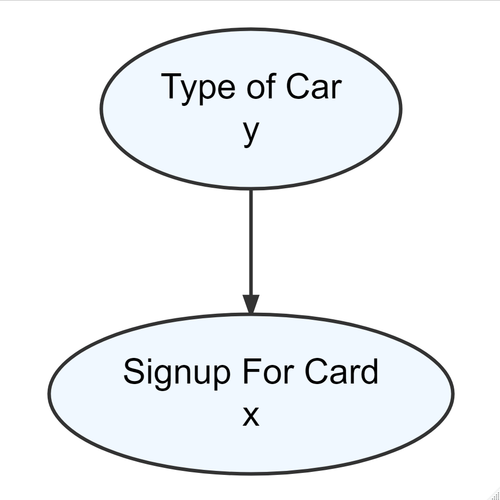
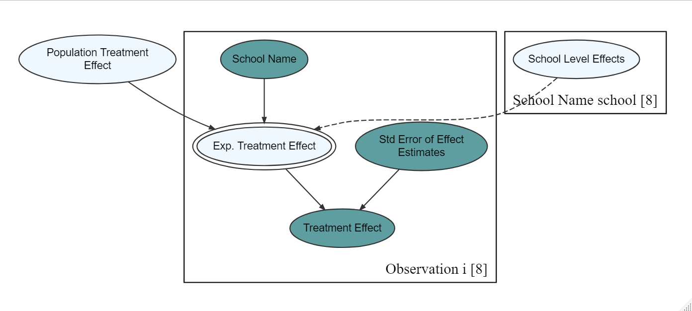
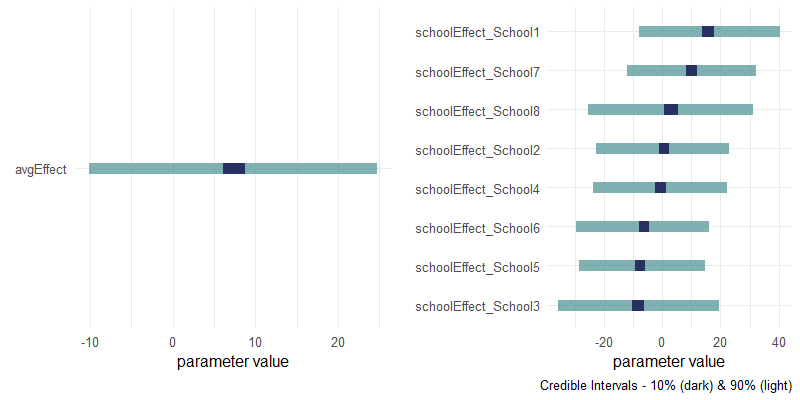

# Summary

The `causact` package provides `R` functions for visualizing and running inference on generative directed acyclic graphs (DAGs).  Once a generative DAG is created, the package automates Bayesian inference via the `greta` package and `TensorFlow`.  The package eliminates the need for three separate versions of a model: the narrative describing the problem, the statistical model representing the problem, and the computer model which codifies the model in a probabilistic programming language.  Instead, `causact` users create one model, a generative DAG, that unifies the three using a visual representation. 

# Introduction

Bayesian data analysis mixes data with domain knowledge to quantify uncertainty in unknown outcomes.  Its beautifully-simple theoretical underpinnings are deployed in three main steps [@gelman2013bayesian]:

- **Modelling:** Joint probability distributions are specified to encode domain knowledge about potential data generating processes.
- **Conditioning:** Bayes rule is used to reallocate plausibility among the potential data generating processes to be consistent with both the encoded domain knowledge and the observed data.  The conditioned model is known as the posterior distribution.
- **Validation:** Evidence is collected to see whether the specified model as well as the computational implementation of the model and conditioning process are to be trusted or not.

Computational implementations facilitating these steps have flourished over the last few decades.  One prospering class of these implementations are referred to as probabilistic programming languages (PPLs), and each language is implemented either as a stand-alone domain-specific language (DSL) or as part of a more general-purpose programming language (GPL).  Notable DSL examples include `WinBUGS` [@lunn2000winbugs}, `JAGS` [@plummer2003jags}, and `Stan` [@stan_development_team}. And note-worthy GPL packages - which do not require users to learn another coding language and often seemlessly interface with DSLs - include `R`'s `brms` [@burkner2017brms] and `greta` [@golding2019greta]; `Python`'s `Pyro` [@bingham2019pyro] and `TensorFlow Probability` [@dillon2017tensorflow]; and `Julia`'s `Turing` [@ge2018turing].

The recent surge in popularity of PPLs is largely due to algorithmic advances in the conditioning step of Bayesian data analysis.  Practical and complex statistical models which are analytically intractable can now be solved computationally using inference algorithms.  In particular, Markov Chain Monte Carlo (MCMC) algorithms [@gelfand1990sampling, gilks1996strategies,congdon2010applied} handle arbitrarily large and complex models via highly effective sampling processes that quickly detect high-probability areas of the underlying distribution [@neal1993probabilistic,pfeffer2016practical,kruschke2014doing}.  Most of the existing probabilistic programming languages come with several built-in variants of MCMC algorithms such as Metropolis sampling, Gibbs sampling, Hamiltonian MCMC, and the NUTS sampler [@hoffman2014no}.

The `causact` package, presented in this paper, relies on `R` as its host language and is focused on making the *modelling* step of Bayesian data analysis more visual, more intuitive, and more collaborative with non-technical domain experts.  Currently, all PPLs expect a well-defined statistical model to be known prior to writing the code representing that model.  This creates friction in the modelling process as often a statistical modelling expert and a domain expert collaborate on how to yield useful inferences from data.  Prior to `causact`, any agreed upon narrative of a data-generating process must be modelled in code using an error-prone process where model misspecification, variable indexing errors, prior distribution omissions, and other mismatches between desired model and coded model go easily unnoticed.  

To unify inference-problem narratives, the statistical models representing those narratives, and the code implementing the statistical models, `causact` introduces a modified visualization of *directed acyclic graphs* (DAGs), called the *generative DAG*, to serve as a more intuitive and collaborative interface into probabilistic programming languages. Modellers using `causact` functions to define their DAGs can automatically obtain both visual model and equivalent probabilistic program code. For modelers familiar with `R`, the easily-made model visualizations provide a link from problem narrative to implemented code for computational inference facilitating successful collaborations and ensuring models that are faithful to the desired abstractions of real-world data generating processes.  

# Modelling for Computational Bayesian Inference

Knowledge from both computer science (programming language) and statistics (inference algorithms and probability theory) are required to model and solve problems using PPLs.  While statistical models are denoted mathematically, probabilistic programming language models are denoted as computer programs (i.e. executable code). For example, a simple coin-flipping model in which the probability of a coin coming up heads ($\theta$) is assigned a prior $\textrm{Beta}(1,1)$ distribution can be represented as a statistical model (\ref{eqn:coinFlip}):

\begin{align}
\label{eqn:coinFlip}
\begin{split}
\theta &\sim \text{Beta}(1,1)\\
y_i &\sim \text{Bernoulli}(\theta), \quad \forall i \in \mathbb{N}
\end{split}
\end{align}

And, as an equivalent probabilistic program in its `Stan` code equivalent:

```
# Declare data
data {
  int<lower=0> N;
  int<lower=0,upper=1> y[N];
}

# Define parameters of interest
parameters {
  real<lower=0, upper=1> theta;
}

# Define model
model {
  theta ~ beta(1, 1); # Prior
  for (n in 1:N)
    y[n] ~ bernoulli(theta); # Data
```

And additionally, as written using `Julia`'s `Turing` package is shown below:

```
@model coinflip(y) = begin
    p ~ Beta(1, 1) # Prior

    N = length(y) # Number of observations
    for n in 1:N
        y[n] ~ Bernoulli(p) # Data
    end
end;
```

Stan or Turing takes the corresponding model specification, runs an inference algorithm, and samples the posterior probability of the coin coming up heads ($\theta$) after observing the result of N coin flips. All of this with just a few lines of code.  Similarly, arbitrarily complex and large probabilistic inference problems can be represented and solved by PPLs. The flexibility and expressive power of programming languages in the form of conditional statements, recursive loops, user-defined functions and various data structures enable users to capture rich and complicated systems with numerous interacting events and entities [@pfeffer2016practical].  

Prior to PPLs, Bayesian networks were the default representation language of probabilistic models and are still considered a major step toward developing a formal language for defining probabilistic models [@pfeffer2016practical]. A Bayesian network is a directed acyclic graph (DAG) whose nodes are random variables and whose edges denote the dependencies or relationships among the nodes. Additionally, each node is associated with a conditional probability distribution numerically encoding the node's dependence on its parents [@koller2009probabilistic; @chen2017learning]. The DAG of a Bayesian network represents the qualitative part or the structure of the network. Particularly, it encodes all of the variables that domain experts deem relevant to the problem at hand and the relationship among these variables.  The associated conditional probability distributions, on the other hand, correspond to the quantitative part of the network, numerically quantifying the dependence of variables on their parents [@darwiche2009modeling].  In total, a Bayesian network is a highly compact representation of the underlying joint probability distribution of the model - reflecting both quantitative and qualitative components. 

While a statistical model might accompany a Bayesian network graph to serve as the framework for creating PPL code, the model and associated graph are rarely created at the beginning of a statistical modelling journey.  Often, that beginning starts with a question, problem, or context of interest.  A domain expert might choose to communicate this starting point using a written description, a Powerpoint presentation, a flowchart, or a speech  - we refer to this communication as the *narrative*.  If the translation between the narrative and the statistical model is flawed, then any inferences garnered from a PPL will be equally flawed.

To ensure alignment between narratives and statistical models, the `causact` package advocates using a special type of DAG, the *generative DAG*, which is a Bayesian network that includes the statistical model, the Bayesian network graph, and key narrative elements all in one representation.  Figure \autoref{fig:coinFlip} shows a generative DAG for the simple coin flip model created using `causact`. Each node is a random variable.  The narrative is reflected in the top line of each node and the corresponding statistical model stated on the second line of each node. From this graph, PPL code using `R` functions from the `greta` package [@golding2019greta] can be automatically generated and executed without any additional coding.  Additionally, narrative-only graphs, excluding technical details, can be generated for discussions with non-statistical domain experts.  

<center>
  { width=30% }
</center>

# Modelling with Generative DAGs

Generative DAGs pursue two simultaneous goals.  One goal is to capture the narrative by building a conceptual understanding of the data generating process that lends itself to statistical modelling.  And two, gather all the mathematical elements needed for specifying a complete Bayesian model of the data generating process.  Both of these goals will be satisfied by iteratively assessing the narrative and the narrative's translation into rigorous mathematics using `causact` functions.

For illustration, we use an example from Chapter 12 of @fleischhacker2020business with data that is built into `causact`.  The objective is to analyze a customer's propensity to sign-up for a credit card offer.   Here is the narrative: 

> "BankPass is an auto financing company that is launching a new credit card, the Travel Rewards Card (TRC). The card is designed for people who love to take adventure vacations like ziplining, kayaking, scuba diving, and the like. To date, BankPass has been randomly selecting a small number of its customers to target with a private offer to sign up for the card... Since they are an auto-loan company, they are curious about whether the model of car (e.g. Kia Forte, Toyota Corolla, etc.) being financed influences a customer’s willingness to sign up for the credit card."

Capturing the narrative in code starts with using `dag_create()` to initialize a `causact_graph` object.  Next, `dag_node` creates a representation of a random variable where the `descr` argument captures the narrative part of the generative story.  Here, we use the chaining operator `%>%` to build a DAG from the individual elements.  The chaining operator, `%>%`, is a simple yet useful tool for expressing a sequence of operations \citep{wickham2016r} where it inserts the output of the function preceding the operator as the first argument in the function immediately after the chaining operator.  Since all `dag_foo()` functions output `causact_graph` objects and also take a `causact_graph` object as their first argument, this makes for a very readable workflow.  Finishing this example's sequence, `dag_render(shortLabel = TRUE)` provides the visualization in Figure \autoref{fig:card1} showing what has been defined, but excluding any mathematical notation:

```
R> library(causact)
R> dag_create() %>% 
+    dag_node(descr = "Signup For Card") %>% 
+    dag_node(descr = "Type of Car") %>% 
+    dag_node(descr = "Adventurous Personality") %>% 
+    dag_render(shortLabel = TRUE)
```

<center>
  { width=70% }
</center>

To make referring to each node easier, math labels are introduced using the `label` argument.  And to connect the nodes so they reflect the causal story where parent node values have direct influence on child node values, the `child` argument is used to specify children nodes who have their probability distributions defined as conditional on the parent nodes.  Figure \autoref{fig:card2} shows the output of this code:

```
R> dag_create() %>% 
+    dag_node(descr = "Signup For Card", label = "x") %>% 
+    dag_node(descr = "Type of Car", label = "y") %>% 
+    dag_node(descr = "Adventurous Personality", label = "z",
+             child = c("x","y")) %>% 
+    dag_render()
```

<center>
  { width=50% }
</center>

For the statistical expert, the narrative of Figure \autoref{fig:card2} reflects an indirect influence that the observed variables of car type ($y$) and card signup ($x$) have on each other due to their latent common parent, adventurous personality ($z$).  Since personality ($z$) is never intended to be measured or estimated, the statistical modelling goal morphs to measure the association between car type ($y$) and card signup ($x$) as reflected in the code below used to generate Figure \ref{fig:card3}:

```
R> dag_create() %>% 
+    dag_node(descr = "Signup For Card", label = "x") %>% 
+    dag_node(descr = "Type of Car", label = "y",
+             child = "x") %>% 
+    dag_render()
```

<center>
  { width=35% }
</center>

At this point, the model of Figure \autoref{fig:card3} is missing the primary component of a generative DAG, namely the Bayesian network, and we now formally define what this means.  A complete Bayesian network is a DAG, $G$, whose nodes, $X_1,X_2,\ldots,X_N$, represent random variables with joint density function $\pi$ that factorizes as a product of conditional distributions:

\begin{equation}
\pi(x_1,x_2,\ldots,x_n) = \prod_{i=1}^{n}\pi\left(x_i|\textrm{Parents}\left(x_i\right)\right)
\end{equation}

where $x_i$ is shorthand for $X_i = x_i$ and $\textrm{Parents}(X_i)$ are given values for all nodes with edges leading into $X_i$ as specified in $G$.  For Bayesian data analysis, it is often convenient to classify Bayesian-network nodes on whether they are data, let's call those nodes $y_1,y_2,\ldots,y_m$, or distribution parameters, let's call those nodes $\theta_1,\theta_2,\ldots,\theta_n$.  In this case, the modelling goal is to specify domain knowledge as a joint density function for all potential observations and parameters decomposed into a conditional probability called the likelihood and marginal density function known as the prior:

\begin{equation}
\pi(y_1,y_2,\ldots,y_m,\theta_1,\theta_2,\ldots,\theta_n) = \underbrace{\pi(y_1,y_2,\ldots,y_m | \theta_1,\theta_2,\ldots,\theta_n)}_{likelihood} \times \underbrace{\pi(\theta_1,\theta_2,\ldots,\theta_n)}_{prior}
\end{equation}

For simple illustration of how a Bayesian network yields a joint density function with node densities conditional on parent values, take the beta-Bernoulli model of Figure \autoref{fig:coinFlip}. The bottom node contributes the likelihood function, $\pi_Y(y|\theta)$, with support on $y \in \{0,1\}$ and specified as $\pi_Y(y=1|\theta) = \theta$ and $\pi_Y(y=0|\theta) = 1 - \theta$ (i.e. it is a Bernoulli-distributed random variable); and the top node contributes the prior for $\theta$, $\pi_\Theta(\theta)$, which is given by the density function for the two-parameter $\textrm{beta}$ distribution with both shape and scale equal to one.  This is just a uniform distribution and for all supported values $0 \leq \theta \leq 1$, we have $\pi_\Theta(\theta) = 1$.  Thus, the joint density for Figure \autoref{fig:coinFlip} is given by likelihood times prior:

\begin{equation*}
\pi(y,\theta) = \begin{cases}
\theta \times 1 &\text{if $y=1$ and $0 \leq \theta \leq 1$}\\
(1-\theta) \times 1 &\text{if $y=0$ and $0 \leq \theta \leq 1$}\\
0 &\text{otherwise.}
\end{cases}
\end{equation*}

Speaking more generally, the goal of Bayesian data analysis as implemented in the `causact` package is to reallocate plausibility over the unobserved parameter values in a Bayesian network conditioned on observed data, $\tilde{y}$.  Bayes rule provides this reallocation and yields a posterior density function updating the joint density function for all supported values of $\theta_1,\theta_2,\ldots,\theta_n$:

\begin{equation}
\label{eqn:bayes}
\underbrace{\pi(\theta_1,\theta_2,\ldots,\theta_n | \tilde{y}_1,\tilde{y}_2,\ldots,\tilde{y}_m)}_{posterior} = \frac{\pi(\tilde{y}_1,\tilde{y}_2,\ldots,\tilde{y}_m | \theta_1,\theta_2,\ldots,\theta_n) \times \pi(\theta_1,\theta_2,\ldots,\theta_n)}{\pi(\tilde{y}_1,\tilde{y}_2,\ldots,\tilde{y}_m)}
\end{equation}

In most real-world modelling scenarios, analytically-solvable conjugate priors (e.g. a beta prior for a Bernoulli observation) fail to faithfully capture domain knowledge and the elicited distributions used to represent domain knowledge are not analytically tractable.  The intractability is due to complex integrals arising in the denominator on the right-hand side of (\autoref{eqn:bayes}).  Fortunately, that denominator is just a normalizing constant and probabilistic computation allows us to sample from the posterior distribution using just the unnormalized density function.  Hence, PPL-based Bayesian computation relies on this unnormalized version of Bayes rule:

\begin{equation}
\label{eqn:bayesProp}
\pi(\theta_1,\theta_2,\ldots,\theta_n | \tilde{y}_1,\tilde{y}_2,\ldots,\tilde{y}_m) \propto \pi(\tilde{y}_1,\tilde{y}_2,\ldots,\tilde{y}_m | \theta_1,\theta_2,\ldots,\theta_n) \times \pi(\theta_1,\theta_2,\ldots,\theta_n)
\end{equation}

To transition Figure \autoref{fig:card3} to a generative DAG, we must now specify a Bayesian network structure consistent with the narrative.    In practice, this is often easier to do bottom-up than top-down and one should add parent nodes for distribution parameters as needed.  For example, modelling a Bernoulli random variable, like whether someone signs up for a credit card, requires a parameter $\theta$ that is not part of Figure \autoref{fig:card3}. In addition to the Bayesian network structure, observed data which will be conditioned on should be associated with each observed node.  Lastly, any repetitive structure in the Bayesian network can be more concisely communicated using plates [@koller2009probabilistic; @betancourt2020].  Considering all of the aforementioned, the following generative DAG can be constructed using the `rhs` argument to add formulas, the `data` argument to extract data from a built-in dataset called `carModelDF`, and the `dag_plate()` function to model independent $\theta$ values for each unique car model in the dataset.  Here is the code used to generate Figure \autoref{fig:complete}.

```
R> dag_create() %>% 
+    dag_node(descr = "Signup For Card", label = "x",
+             rhs = bernoulli(theta),
+             data = carModelDF$getCard) %>% 
+    dag_node(descr = "Signup Probability", label = "theta",
+             rhs = beta(1,1),
+             child = "x") %>% 
+    dag_plate(descr = "Type of Car", label = "y",
+              nodeLabels = c("theta"),
+              addDataNode = TRUE,
+              data = carModelDF$carModel) %>%
+    dag_plate(descr = "Observation", label = "i",
+              nodeLabels = c("y","x")) %>% 
+    dag_render()
```

<center>
  { width=70% }
</center>

From the picture, we can deduce the posterior density function.  Since the bracketed number in the lower-right hand corner indicates repetitions of each plate, we see there are 1,000 observations in the dataset and four unique types of cars. The variables we are inferring from the data represent the four different success probabilities, $\theta_1,\theta_2,\theta_3,\theta_4$, associated with each of the four different cars, $Val(y) \in \{1,2,3,4\}$ (an index set).  The 1,000 repeated observations consist of $x_i,y_i$ pairs where $x_i$ is a binary-valued random variable equalling $1$ for success and $0$ for failure, and with $\theta_{y_i}$ indicating which of the four success probabilities is applied to the $i^{th}$ observation.  Hence, leveraging the Bayesian network independencies, the density function of (\autoref{eqn:bayesProp}) simplifies as follows: 

\begin{align}
\label{eqn:bayesPropApplied}
\begin{split}
\pi(\theta_1,\theta_2,\theta_3,\theta_4 | \tilde{x}_1,\tilde{x}_2,\ldots,\tilde{x}_{1000}) &\propto \pi(\tilde{x}_1,\tilde{x}_2,\ldots,\tilde{x}_{1000} | \theta_1,\theta_2,\theta_3,\theta_4) \times \pi(\theta_1,\theta_2,\theta_3,\theta_4)\\
& \propto \underbrace{\prod_{i=1}^{1000}\pi_{\textrm{Bern}(\theta_{y_i})}(x_i|\theta_{y_i})}_{likelihood} \times \underbrace{\prod_{j=1}^{4}\pi_{\textrm{Beta}(1,1)}(\theta_j)}_{prior}
\end{split}
\end{align}

Fortunately, `causact` isolates us from both the mathematical formulation, as in (\autoref{eqn:bayesPropApplied}), and any associated PPL code required for computational inference.  For most use cases, a few guiding rules help to ensure that the visualized generative DAG, as in Figure \autoref{fig:complete}, can be automatically turned into PPL code:


- All unobserved nodes and observed nodes with parents have a supplied `rhs` argument.  Observed nodes, like $y$ in Figure \autoref{fig:complete}, may exclude this argument and will not be modelled as part of the posterior joint density function.
- The `rhs` argument of unobserved nodes contain only continuous distributions - unobserved discrete distributions must be summed out or handled using sampling methods that are not part of `causact`; this is a common issue among PPLs, including `{Stan} when using efficient sampling algorithms like the NUTS sampler [@hoffman2014no].  Observed nodes may be modelled using continuous or discrete distributions. 
- All variables passed to the `rhs` argument of a child node must appear as a parent node to that child.
- Distributions are selected from the supported list of distributions as can be accessed by typing `?greta::distributions`.  Over 25 of the most common distributions are available including the basic ones like binomial and normal distributions, and also more complex mulitvariate distributions like the Dirichlet and the Lewandowski-Kurowicka-Joe (LKJ) distributions [@lewandowski2009generating].
- Plates are not nested (to be supported in future releases).


The simplicity with which generative DAGs are constructed belies the complexity of models which can be supported.  Multi-level or hierarchical models are easily constructed as shown in \S\autoref{sec:together}.

\section{Core Functions} \label{sec:core}

`causact` provides tools that make for a seamless model building workflow: defining a probabilistic model, analyzing the model, and iterating over model revisions [@betancourt2020b]. The less time it takes modelers to evaluate a model, the more time they have to try out other options. The finalized model which is represented graphically as a generative DAG, rather than textually or mathematically, can then be presented to and discussed with end-users. Most importantly, `causact` liberates users from the need to learn complicated probabilistic programming languages or any sophisticated computation tools necessary to do probabilistic reasoning. Thus, `causact` is expected to make probabilistic modeling and probabilistic inference more accessible to less-technical analysts and domain experts. Seven core functions are central to enabling this fast workflow.

## `dag_create()`

`dag_create()` initializes an empty graph object of class `causact_graph`. Nodes and edges will be later supplied by users to extend this empty graph object. The below code snippet creates an initialized object named `graph`:
  
```
R> graph = dag_create()
```
    
Behind the scenes, this function creates a list of several empty data frames like `nodes_df` and `edges_df` that support the creation of generative DAGs. These data frames will later be populated by the information that users supply when they add nodes, edges, and plates. To view inside a specific data frame, users use the following syntax:
    
```
R> graph$nodes_df
```
```
 [1] id         label      descr      data       rhs        child     
 [7] obs        rhsID      distr      auto_label auto_descr auto_data 
[13] dimID      auto_rhs  
<0 rows> (or 0-length row.names)
```

Behind the scenes, this function creates a list of several empty data frames like `nodes_df` and `edges_df` that support the creation of generative DAGs. These data frames will later be populated by the information that users supply when they add nodes, edges, and plates. To view inside a specific data frame, users use the following syntax:
    
```
R> graph$nodes_df
```

```
 [1] id         label      descr      data       rhs        child     
 [7] obs        rhsID      distr      auto_label auto_descr auto_data 
[13] dimID      auto_rhs  
<0 rows> (or 0-length row.names)
```
    
## `dag_node()`

`dag_node()` is used to add a node to a `causact_graph` object.  Its most commonly used arguments are as follows:
  
- `graph`: a graph object of class `causact_graph} created using `dag_create()}.
- `descr`: a longer more descriptive character label for the node.
- `label`: a shorter character label for referencing the node (e.g. `"Y"`,`"theta"`).
- `rhs`: either a probability distribution such as `uniform, normal, lognormal, bernoulli,` etc. or an `R` expression. The distribution arguments are optional.  Valid values include `normal(mu,sigma)`, `normal`, and `normal(6,2)`. R computation/expression examples include `alpha+beta*x` or `ilogit(alpha + gamma + beta)`.  If a distribution is given, this is a random/stochastic node. If a formula is given, it is a deterministic node once given the values of its parents. Quotes should not be used as all function/computations should consist of `R` objects, functions, and constants.
- `child`: an optional character vector of existing node labels.  Directed edges from the newly created node to the supplied/child nodes will be created.
- `data`: a vector or data frame (with observations in rows and variables in columns).

`dag_node()` returns a graph object of class `causact_graph`. Note that if the `data` argument is supplied the node will have a darker fill in the rendered visualization indicating that it is an observed node.  Moreover, if a formula is given, i.e. a node is a deterministic function of its parents, then the node will have a double-lined perimeter.

## `dag_edge()`

`dag_edge` adds edge between nodes.  This can be used in place of the `child` argument to `dag_node()`.  In addition to the `graph` argument`, it has two mandatory arguments:

- `graph`: a graph object of class `causact_graph` created using `dag_create()`.
- `from`: a character vector representing the parent node labels or descriptions from which edges should be drawn from.
- `to`: a character vector representing the child node labels or descriptions from which edges should be drawn to.

## dag_plate()

Plates are a very powerful tool for compactly representing repeated structure and parameters. Particularly, in several models it is often assumed that data points are independently sampled from the same distribution and we can encode this assumption using plates. Using plates to represent thousands or even millions of identically independently distributed data points certainly would make a Bayesian network more compact.

`dag_plate()` has six commonly used arguments:

- `graph`: a graph object of class `causact_graph` created using `dag_create()}.
- `descr`: a longer more descriptive character label for the cluster/plate.
- `label`: a short character string to use as an index.
- `nodeLabels`: a character vector of node labels or descriptions to include in the list of nodes.
- `data`: a vector representing the categorical data whose unique values become the plate index. To use with `addDataNode = TRUE`, this vector should represent observations of a variable that can be coerced to a factor.
- `addDataNode`: a logical value.  When `addDataNode = TRUE`, the code attempts to add a node of observed data that is used as an index for extracting the correct parameter from parent nodes that are on the newly created plate.  Verify the graphical model using `dag_render()` to ensure correct behavior.


## `dag_render()`

`dag_create()`, `dag_node()`, `dag_edge()`, and `dag_plate()` are the four functions used to build generative DAGs.  `dag_render()` is then used to visualize the nodes, edges, and plates that have been defined so far.  Unlike a PPL where the complete statistical model requires definition prior to working with it, `dag_render()` allows for peeking at models under construction.

Here is the DAG code for constructing and visualizing an oft-cited Bayesian example known as eight schools [@JSSv012i03] and its data is included in `causact` (`causact::schoolsDF`).  The example is a study of coaching effects on test scores where students from eight schools were put into coached and uncoached groups.

```
R> graph = dag_create() %>%
+    dag_node("Treatment Effect","y",
+             rhs = normal(theta, sigma),
+             data = causact::schoolsDF$y) %>%
+    dag_node("Std Error of Effect Estimates","sigma",
+             data = causact::schoolsDF$sigma,
+             child = "y") %>%
+    dag_node("Exp. Treatment Effect","theta",
+             child = "y",
+             rhs = avgEffect + schoolEffect) %>%
+    dag_node("Population Treatment Effect","avgEffect",
+             child = "theta",
+             rhs = normal(0,30)) %>%
+    dag_node("School Level Effects","schoolEffect",
+             rhs = normal(0,30),
+             child = "theta") %>%
+    dag_plate("Observation","i",nodeLabels = c("sigma","y","theta")) %>%
+    dag_plate("School Name","school",
+              nodeLabels = "schoolEffect",
+              data = causact::schoolsDF$schoolName,
+              addDataNode = TRUE)
R> graph %>% dag_render()
```

<center>
  { width=98% }
</center>

In Figure \autoref{fig:eightSchools}, the darker filled nodes are observed data; the lighter-filled nodes are either latent parameters (single perimeter); or deterministic nodes (double perimeter) whose values are deterministic functions of their parent node values.  The dashed edge from the school name plate reflects that not all eight parameters of `schoolEffect` are used to generate a single observation of data - only one extracted parameter based on the observed school name is used for an individual expected treatment effect observation.  Figure \autoref{fig:eightSchools} can be replicated without the math for less intimidating discussions with domain experts about the model using the `shortLabel = TRUE` argument.

```
R> graph %>% dag_render(shortLabel = TRUE)
```

<center>
  { width=98% }
</center>

All visualizations, including Figures \autoref{fig:eightSchools} and \autoref{fig:eightShort}, are created via `causact`'s calls to the `DiagrammeR` package [@iannone20].  The `dag_diagrammer()` function can convert a `causact_graph` to a `dgr_graph` (the main object when using `DiagrammeR`) for further customizing of a visualization using the `DiagrammeR` package. 

## `dag_greta()`

`dag_greta()` translates the probabilistic model encoded in a `causact_graph` object to the equivalent probabilistic program using functions from the `greta` package. If no additional arguments are provided, `dag_greta()` will return a data frame of 4,000 draws from the joint posterior distribution of all unobserved parameters.  The sampling method used is the NUTS sampler and is well-known for achieving representative results of moderately complex models with only a few thousand samples.   

Sampling from the posterior of the eight schools model (Figure \autoref{fig:eightSchools}) does not require a user to write PPL code, but rather a user will simply pass the generative DAG object to `dag_greta()` and then inspect the data frame of posterior draws:

```
R> library(greta) ## greta uses TensorFlow to get sample
R> drawsDF = graph %>% dag_greta()
R> drawsDF
```

```
# A tibble: 4,000 x 9
   avgEffect schoolEffect_Sc~ schoolEffect_Sc~ schoolEffect_Sc~
       <dbl>            <dbl>            <dbl>            <dbl>
 1     0.102            40.1              3.59            -4.51
 2     4.59             23.6              4.43           -26.3 
 3    -0.451            18.5             24.3             16.5 
 4    18.9               8.07           -26.3            -28.6 
 5    17.3              -5.83            -4.25           -26.2 
 6     1.97             42.7              2.25            12.6 
 7    12.7             -11.2              5.31           -16.5 
 8     9.11            -17.4              9.09           -12.7 
 9    -3.74             71.5              1.82            23.6 
10    -2.43             48.2            -13.3              2.89
# ... with 3,990 more rows, and 5 more variables:
#   schoolEffect_School4 <dbl>, schoolEffect_School5 <dbl>,
#   schoolEffect_School6 <dbl>, schoolEffect_School7 <dbl>,
#   schoolEffect_School8 <dbl>
```

For either debugging or further customizing a model, the `greta` code can be printed to the screen without executing it by setting the `mcmc` argument to `FALSE`:

```
R> graph %>% dag_greta(mcmc=FALSE)
```

```
sigma <- as_data(causact::schoolsDF$\$$sigma)   #DATA
y <- as_data(causact::schoolsDF$\$$y)           #DATA
school     <- as.factor(causact::schoolsDF$\$$schoolName)   #DIM
school_dim <- length(unique(school))   #DIM
schoolEffect <- normal(mean = 0, sd = 30, dim = school_dim) #PRIOR
avgEffect    <- normal(mean = 0, sd = 30)                   #PRIOR
theta  <- avgEffect + schoolEffect[school]   #OPERATION
distribution(y) <- normal(mean = theta, sd = sigma)   #LIKELIHOOD
gretaModel  <- model(avgEffect,schoolEffect)   #MODEL
meaningfulLabels(graph)
draws       <- mcmc(gretaModel)              #POSTERIOR
drawsDF     <- replaceLabels(draws) %>% as.matrix() %>%
                dplyr::as_tibble()           #POSTERIOR
tidyDrawsDF <- drawsDF %>% addPriorGroups()  #POSTERIOR
```

The produced `greta` code is shown in the above code snippet.  The code can be difficult to digest for some and exemplifies the advantages of working visually with these models.  The above code is also challenging to write without error or misinterpretation.  Indexing is particularly tricky in PPL's with indexing based on meaningless numbers (e.g. 1,2,3,$\ldots$).  To facilitate quicker interpretation `causact` abbreviates posterior parameters using human-interpretable names generated by combining parameter names with plate index names as needed:

```
R> names(drawsDF)
```
```
[1] "avgEffect"            "schoolEffect_School1"
[3] "schoolEffect_School2" "schoolEffect_School3"
[5] "schoolEffect_School4" "schoolEffect_School5"
[7] "schoolEffect_School6" "schoolEffect_School7"
[9] "schoolEffect_School8"
```

The nine parameters of the model are easily identified and their meaning is clear.  

## dagp_plot()

The output of `dag_greta()` is in the form of a data frame of draws from the joint posterior.  To facilitate a quick look into posterior estimates, the `dagp_plot` function creates a simple visual of 90% credible intervals.  It is the only core function that does not take a graph as its first argument; it takes a data frame of posterior draws.  By grouping all parameters that share the same prior distribution and leveraging the meaningful parameter names constructed using `dag_greta()`, it allows for quick comparisons of parameter values.

```
R> drawsDF %>% dagp_plot()
```

<center>
  { width=78% }
</center>

The code above makes the plot in Figure \autoref{fig:eightPlot}.  For further posterior plotting, users would make their own plots using `ggplot2` [@wickham2016], `ggdist` [@kay2020], or similar.  For further model validation, including MCMC diagnostics, the user would use a package like `bayesplot` [@gabry2019visualization] or `shinystan` [@gabry2018].  For users who prefer to work with an `mcmc` object, they can extract the `draws` object after running the generated `greta` code from `dag_greta(mcmc=FALSE)` or find the object in the `cacheEnv` environment after running `dag_greta(mcmc=FALSE)` using `get("draws",envir = causact:::cacheEnv)`.  

## Putting the Functions Together
\label{sec:together}

With the seven core functions, all the building blocks for large classes of Bayesian data analysis models are in place.  Using the functions, users can represent latent nodes, observed nodes, calculated nodes, edges, plates, probability distributions, and inverse link functions.  This is all you need for linear models, robust linear models, binomial models, count data models, categorical models, survival models, and multi-level models.  For example, the multi-level model of Figure \autoref{fig:multiLevel}, as described in @youtube, uses many of these building blocks, including constructing hyper-priors and using an inverse logit link function, to determine how a customer's proximity to a store impacts their responsiveness to a promotion.

<center>
  { width=105% }
</center>

# Comparison to Other Packages
\label{sec:compare}

By focusing on generative DAG creation as opposed to PPL code, `causact` liberates users from the need to learn complicated probabilistic programming languages. As such, it is similar in spirit to any package whose goal is to make Bayesian inference accessible without learning a PPL.  In this vein, `causact` is similar to `brms` [@burkner2017brms], `rstanarm` [@goodrich], and `rethinking` [@mc20] - three `R` packages which leverage `Stan` for Bayesian statistical inference with MCMC sampling.  Like the `rethinking` package which is tightly integrated with a textbook [@mcelreath2020statistical], a large motivation for developing `causact` was to make learning Bayesian inference easier. The package serves a central role in a textbook titled *A Business Analyst's Introduction to Business Analytics: Intro to Bayesian Business Analytics in the R Ecosystem.* [@fleischhacker2020business].  

Unlike the other packages, `causact` does not use the `Stan` programming language.  `causact` was developed to rely on the `greta` package which is written in `R`.  Both `Stan` and `Turing` prototypes have been experimented with as backends to `causact` - perhaps a future version will be able to reliably use other PPLs.    The `greta` software stack relies on installations of `python`, `TensorFlow`, and `TensorFlow Probability` [@dillon2017tensorflow]. Installation instructions for this software stack can be found in Chapter 15 of @fleischhacker2020business.  
Performance-wise, there are two sources of delay in getting posterior results, compilation time and sampling time.  Roughly speaking, `Stan` programs typically take around thirty seconds to compile, and for small models, this time is usually much more significant than the sampling time which can sometimes feel near instantaneous.  `rstanarm` avoids compilation time by using pre-compiled `Stan` models - hence, it is by far the fastest for smaller models; it is also the least flexible  - see the package feature comparison in @burkner2017brms.  Because of the reliance on `TensorFlow`, `causact` models are also not compiled, but will often sample slightly slower than a similar `Stan`-based model.  The effective difference is that for textbook-sized small and medium problems, like you would find in @mcelreath2020statistical or @fleischhacker2020business, `causact` tends to be a few seconds faster; generally these problems take anywhere from 15 seconds to one minute to sample on a typical laptop.  For larger problems, which can sometimes take days to sample, `Stan` based models are usually much more efficient.  Also, the Stan team is actively working on reducing compilation time, so greatly accelerated `Stan` models are on the horizon.     

`brms` and `rstanarm` focus on quickly constructing multi-level regression models by having default (although easily changeable) priors and a compact syntax.  For example, a similar, but not identical, `brms` model for Figure \ref{fig:eightSchools} might look like this:

```
R> library(brms)
R> fit = brm(y|se(sigma) ~ 1 + (1|schoolName),
+             data = causact::schoolsDF)
```

where prior setting is done via defaults - in this case, two different student-t distributions are used as priors.  This code is concise, but also obfuscates the model details, including the underlying graphical model, which can confuse Bayesian newcomers.    

For the authors of this package, our opinion is that prior setting should rarely be left to a default, but should rather be done using careful consideration of how the generative model structure maps onto real-world phenomenon.  This sentiment is echoed in @gelman2017prior :

> "Recent history of Bayesian inference as a set of converging messages from many directions—theoretical, computational, and applied— {are} all pointing towards the benefits of including real, subject-matter-specific, prior information in order to get more stable and accurate inferences."

The causact modelling syntax is flexible and, like \pkg{rethinking}, encourages modellers to make bespoke models.  \pkg{rethinking} views the statistical model as the entry point to constructing PPL-compatible models.  For example, this equation:

\begin{align*}
y_i &\sim \textrm{Normal}(\mu,\sigma)\\
\mu &\sim \textrm{Normal}(0,10)\\
\sigma &\sim \textrm{Exponential(1)}
\end{align*}

would be represented in `rethinking` as:

```
f <- alist(
    y ~ dnorm( mu , sigma ),
    mu ~ dnorm( 0 , 10 ),
    sigma ~ dexp( 1 )
)

fit <- ulam( 
    f, 
    data=list(y=c(-1,1))
)
```

Whereas `causact` encourages users to build DAGs like the one pictured here:

<center>
  { width=70% }
</center>

by codifying the DAG as opposed to codifying the statistical model.  Here is the `causact` code to yield inference from the above model:

```
dag_create() %>% 
 dag_node("Data","y", 
          rhs = normal(mu,sigma),
          data = c(-1,1)) %>% 
 dag_node("Mean","mu", 
          rhs = normal(0,10)) %>% 
 dag_node("Std. Dev.","sigma", 
          rhs = exponential(1)) %>% 
 dag_edge(c("mu","sigma"),"y") %>% 
 dag_greta()
```

There are other packages taking advantage of using DAG-based visualization and/or inference, but are not leveraging a modern PPL.  The `gRain` package [@hojsgaard2012graphical] helps users to create Bayesian network models using conditional probability tables and then query the graph.  Visualization and inference are both central to the package, yet it's exact inference algorithms only handle discrete variables and exact algorithms are often computationally expensive and `ggdag` [@barrett2020ggdag] are both tools for drawing DAGs, but the focus of those packages is more on analyzing causal paths in the Bayesian network and they do not connect to any inference engines for sampling posteriors.

# Conclusion
\label{sec:summary}

The long-term plan for the `causact` package is to promote a Bayesian workflow that philosophically mimics the Principled Bayesian Workflow outlined by @betancourt2020b.  In its current version on `CRAN` (v0.4.0), the implementation is slightly less ambitious and focuses on starting a path towards solving the three-language problem in Bayesian data analysis where narrative, statistical model, and probabilistic programming code live in three separate places.  The unifying mechanism is `causact`'s generative DAG. 

Note that there is no "black box-ness" in the construction process of \pkg{causact}'s generative DAGs. The structure of a generative DAG is sure to be much more transparent and interpretable than most other modern machine learning workflows; this is especially true when models are made accessible to those without statistical or coding expertise.  For this reason, generative DAGs can help facilitate effective communication between modelers and domain users both during the designing process of the models and when explaining the results returned by the models.

# Computational details
The results in this paper were obtained using
`R` v4.0.3 with the
`causact` v0.4.0 package. `R` itself
and all packages used, with the exception of the `rethinking` package, are available from the Comprehensive
R Archive Network (CRAN) at
https://CRAN.R-project.org/.  `rethinking` is available at https://github.com/rmcelreath/rethinking.

# Acknowledgements

The `Stan` Development team has been inspirational for this work and has formed a wonderful Bayesian inference community around their powerful language.  Additionally, the books of @kruschke2014doing and @mcelreath2020statistical are tremendous resources for learning Bayesian data analysis and their pedagogy is aspirational.  Lastly, thanks to the University of Delaware students, MBAs and PhDs, who have contributed time, code, testing, and enthusiasm for this project from its beginning.

# References